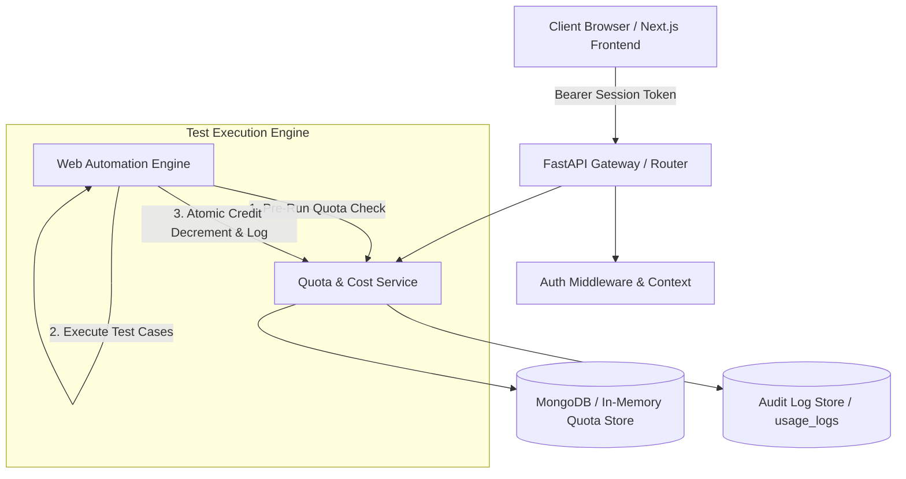
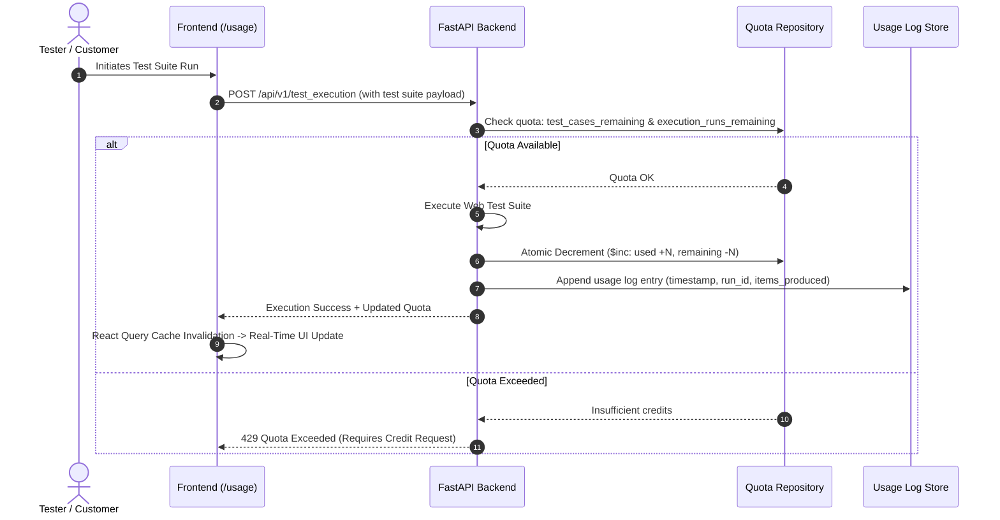

# Testmaite Customer Cost & Usage Dashboard
## Technical Architecture & Feature Logic Documentation

This document provides a comprehensive end-to-end technical breakdown of the **Customer Cost & Usage Dashboard**, detailing the underlying system architecture, data models, state flows, business rules, and real-time credit consumption logic.

---

## 🏛️ System Architecture Overview

The system follows a reactive, decoupled multi-tier architecture:



---

## ⚙️ Core Features & Business Logic (End-to-End)

### 1. Plan & Monthly Quota Consumption Banner
- **Objective**: Provide high-visibility tracking of the customer's current subscription tier and monthly consumption limits.
- **Data Source**: `GET /api/v1/quota`
- **Business Logic & Rules**:
  - **Tier Resolution**: Resolves subscription plan (`Starter` / `Professional` / `Enterprise` or `Free` / `Pro` / `Max`).
  - **Consumption Percentage**: Calculated dynamically as:
    $$\text{Usage \%} = \min\left(100, \left\lfloor \frac{\text{Executions Used}}{\text{Monthly Execution Limit}} \times 100 \right\rfloor\right)$$
  - **Warning Threshold**: When usage exceeds **80%**, the progress bar transitions to an animated warning state to prompt the user for an upgrade before running out of quota.
  - **Billing Cycle Reset**: Calculates the reset timestamp based on the first calendar day of the next month (00:00:00 UTC).
  - **Upgrade Request Action**: Emits an administrative notification event triggering account manager outreach.

---

### 2. Live KPI Metric Cards
- **Objective**: Display real-time operational metrics for test automation inventory and execution volume.
- **Metric Calculations**:
  1. **Test Executions**:
     - $\text{Remaining Executions} = \max(0, \text{Monthly Limit} - \text{Executions Used})$
  2. **Test Cases**:
     - $\text{Available Cases} = \max(0, \text{Monthly Quota} - \text{Cases Generated/Used})$
     - Displays maximum allowed cases per single execution run.
  3. **Execution Runs**:
     - Tracks completed test run sessions with health indicators (pass/fail distribution).
  4. **Execution Time**:
     - Tracks cumulative automation runtime in hours.
     - Computes average duration per test run:
       $$\text{Avg Duration} = \frac{\text{Total Runtime Seconds}}{\text{Total Completed Runs}}$$

---

### 3. Monthly Execution Trend Analysis
- **Objective**: Visualize historical test execution cadence to identify testing spikes and capacity trends.
- **Visualization**: Responsive vector Area Chart with linear gradient fill and smooth cubic bezier interpolation.
- **Logic**: Aggregates test runs bucketed by monthly billing periods.

---

### 4. Automation Usage Category Breakdown
- **Objective**: Transparent visibility into testing types consumed.
- **Scope Rule**: Exclusively dedicated to **Web Tests (100%)** per platform requirements (API & unit/regression tests excluded).

---

### 5. Credits System & Live Decrement Logic

#### 🔄 How Credits are Consumed Live (Step-by-Step Flow):



#### Detailed Consumption Rules:
1. **Pre-Execution Quota Verification**:
   - Before any test run begins, the backend verifies:
     $$\text{cases\_remaining} \ge \text{requested\_cases} \quad \text{AND} \quad \text{runs\_remaining} \ge 1$$
2. **Atomic Quota Decrement**:
   - Updates are executed atomically via MongoDB `$inc` operations (or synchronized in-memory locks) to prevent race conditions during concurrent test executions:
     ```python
     {
         "$inc": {
             "test_cases_used": items_count,
             "test_cases_remaining": -items_count,
             "execution_runs_used": 1,
             "execution_runs_remaining": -1
         },
         "$set": { "last_updated": datetime.now(timezone.utc) }
     }
     ```
3. **Audit Trail Logging**:
   - Every single decrement operation creates an immutable audit record in `usage_logs` containing `user_id`, `action`, `run_id`, `items_requested`, `items_produced`, and `quota_after`.
4. **Live Frontend Synchronization**:
   - The frontend automatically refetches quota metrics every **30 seconds** (`refetchInterval: 30000`) and immediately invalidates cache upon receiving execution results, reflecting updated credit balances with zero page refreshes.

---

### 6. Credits Request & Admin Governance Flow (`/admin/quota`)

#### Business Rules:
- Customers **cannot** directly add or purchase credits manually from the client.
- Team members submit formal requests via the **"Request Additional Credits"** modal.

#### End-to-End Request & Approval Lifecycle:
1. **Submission**: User submits `POST /api/v1/credits/request` with `credit_type` (`execution` / `design`), `amount`, and `reason`.
2. **Pending Queue**: Request enters the admin queue with status `pending` and ISO timestamp.
3. **Admin Review (`/admin/quota`)**:
   - Account administrators (`alice`) access the dedicated **Additional Credit Requests** governance table.
4. **Approval**:
   - Admin clicks **Approve** (`POST /api/v1/quota/admin/credit-requests/{id}/approve`).
   - The backend transitions status to `approved`, stamps `approved_by` and `approved_at`, grants the requested quota increment to the target user, and creates an audit log entry.
5. **Rejection**:
   - Admin clicks **Reject** (`POST /api/v1/quota/admin/credit-requests/{id}/reject`).
   - Status updates to `rejected` without modifying user quota.

---

## 🔒 Security & Role-Based Access Control (RBAC)

| Role | Permissions | Available Routes |
|---|---|---|
| **Customer / Tester** (`tester`) | View personal quota, view personal usage logs, submit credit requests, request plan upgrade. | `/usage`, `/artifacts/*` |
| **Administrator** (`alice`) | View all team member quotas, set plan tiers, reset quotas, review & approve/reject credit requests, aggregate cost analysis. | `/usage`, `/admin/quota`, `/admin/costs` |

---

## 📡 API Endpoint Reference

| Method | Route | Auth Required | Description |
|---|---|---|---|
| `POST` | `/api/v1/auth/login` | None | Authenticates credentials and issues Bearer session token. |
| `GET` | `/api/v1/quota` | User / Admin | Retrieves caller's active plan, quota limits, and remaining credits. |
| `GET` | `/api/v1/quota/usage` | User / Admin | Retrieves paginated execution audit history. |
| `POST` | `/api/v1/credits/request` | User / Admin | Submits a request for additional execution or design credits. |
| `GET` | `/api/v1/quota/admin/credit-requests` | Admin Only | Retrieves all pending and processed credit requests. |
| `POST` | `/api/v1/quota/admin/credit-requests/{id}/approve` | Admin Only | Approves a credit request and increments user allowance. |
| `POST` | `/api/v1/quota/admin/credit-requests/{id}/reject` | Admin Only | Rejects a credit request. |
